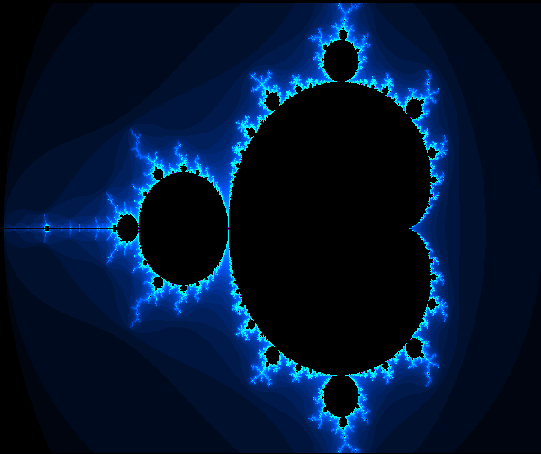
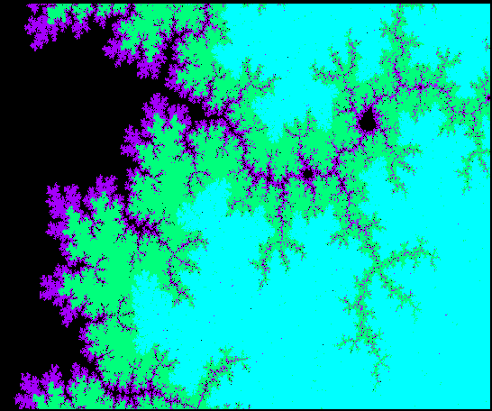
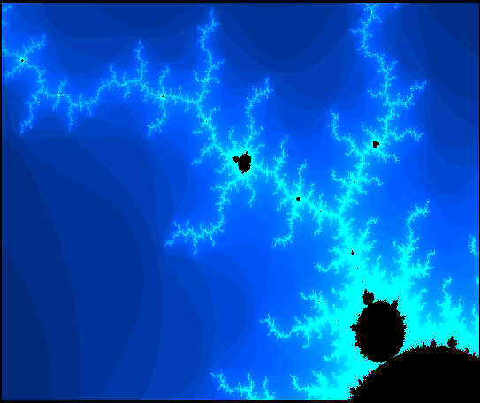
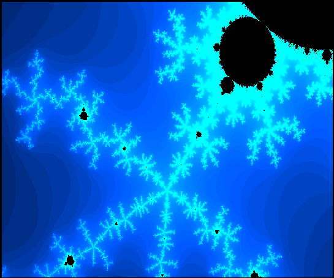
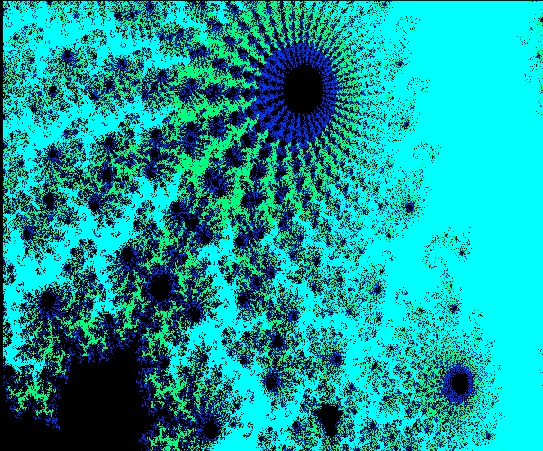
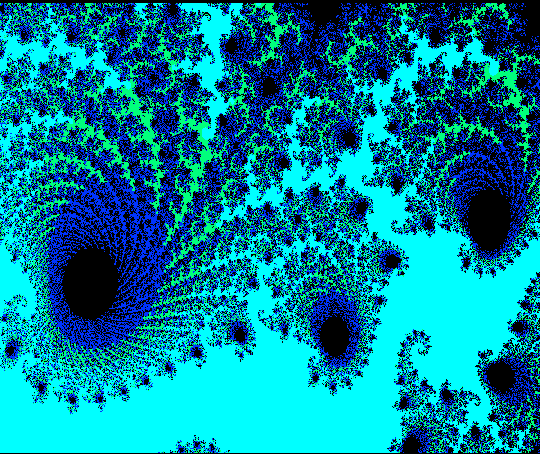

# Conjunto de Mandelbrot - A simples e complexa beleza da matemática

## Fractais

Fractais são um dos objetos matemáticos mais intrigantes que existem. Eles possuem 
formas peculiares e não convencionais e, a medida que se aplica zoom na imagem, pode-se
perceber que há figuras menores e que se assemelham às figuras grandes.

Um dos fractais mais conhecidos é o descoberto pelo matemático Benoit B. Mandelbrot. 
O conjunto de Mandelbrot surge a partir da expressão 
 Zn + 1 = Zn2 + C 
, onde C é um número complexo qualquer.
A expressão começa em 
 Z0 = 0
 e a partir daí os valores serão incrementados na fórmula.
Um detalhe importante é que o valor só é considerado como pertencente ao conjunto caso o módulo de Zn 
seja menor ou igual a 2. Caso contrário, está fora do conjunto.

## Criando o fractal de Mandelbrot no navegador

Fascinado com esse conceito matemático, decidi criar uma representação desse conjunto. Foi desafiador.
Criei um programa em JS que gera esse fractal. Utilizei o próprio Canvas para renderizar a imagem no navegador.
Um dos maiores desafios foi de como otimizar meu programa e aplicar o zoom. Pesquisando muito, encontrei
um outro usuário do GitHub e me inspirei na ideia dele (https://dev.to/foqc/mandelbrot-set-in-js-zoom-in-2hmc).

Vou deixar as imagens do resultado que obtive após a conclusão desse projeto.

### Imagem 1

</img>

### Imagem 2

</img>

### Imagem 3

</img>

### Imagem 4

</img>

### Imagem 5

</img>

### Imagem 6

</img>
